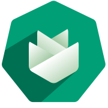

# Metal-API
 

Stack of applications to work with baremetal servers and providing them to the onmetal-api customer.

## Start using or developing metal-api locally

Please see our documentation in the [`/docs`](./docs) folder for more details.

## Feedback and Support

Feedback and contributions are always welcome!

Please report bugs, suggestions or post questions by opening a [Github issue](https://github.com/onmetal/metal-api/issues).

## Licensing

Project is under Apache 2.0 License.
Can be found [here](https://github.com/onmetal/metal-api/blob/main/LICENSE).
