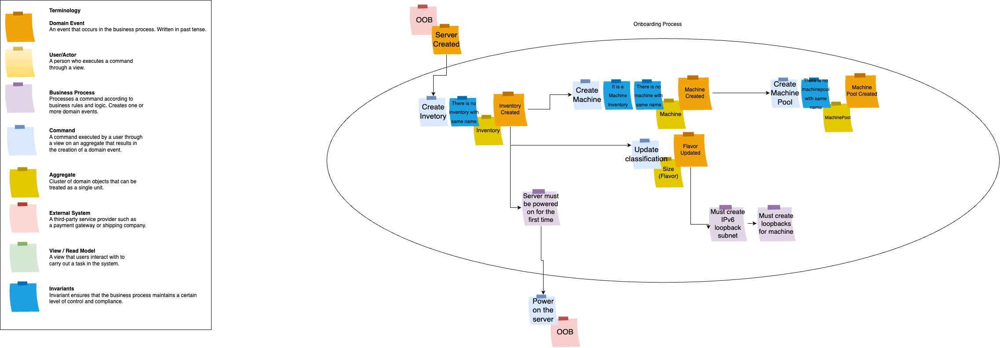

# Machine Onboarding Concepts

Machine onboarding is a crucial process in the IT infrastructure management domain. It involves the provisioning, configuration, and setup of servers to ensure they are ready for operation. This documentation provides a comprehensive overview of the machine onboarding process, including its concepts, rules, and various scenarios.

Machine onboarding is a complex process that starts with the creation of a server. It encompasses a variety of scenarios and business rules that are mandatory for its successful execution.

### Rules Overview

The machine onboarding process can be summarized as follows:

1. `OOB` Creation: The process begins with the creation of a server, which serves as the foundation for subsequent steps.

2. Enabling Servers: Every server that is created must be enabled as soon as it appears. This step is essential for inventory onboarding.

3. IPv6 Subnet Configuration: It is including the creation of a subnet with a prefix size of 64. This subnet should be a part of the parent subnet.

4. Loopback Setup: Loopbacks must be created for each machine. This step is crucial for calculating the Autonomous System Number (ASN).
