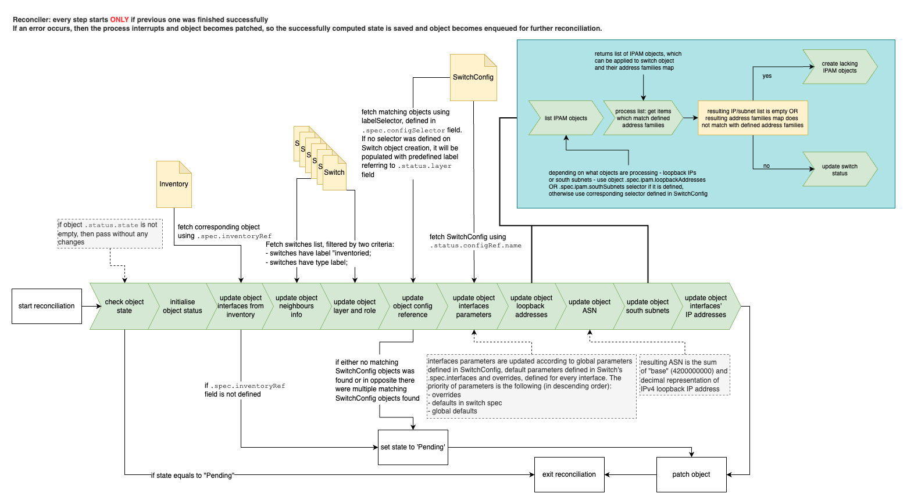

# Switch concept

## Resources

Switch operator manages two custom resources: [`SwitchConfig`](#switchconfig) and [`Switch`](#switch). Apart from that `Switch` objects reconciliation depends on other resources: `Inventory`, `Size` (both are parts of [metal-api](https://github.com/onmetal/metal-api)) and `Subnet`, `IP` (both are parts of [IPAM](https://github.com/onmetal/ipam)). Switches also affect `Machines` (also part of [metal-api](https://github.com/onmetal/metal-api)) in terms of obtaining IP addresses by machines.

## SwitchConfig

The purpose of `SwitchConfig` type is to describe and define the common network configuration shared for a group of switches.

### Brief type description

`SwitchConfig` object's spec contains:

- default values for switch ports parameters such as FEC, MTU, number of lanes used by each switch port, operational state, IPv4 mask length and IPv6 prefix;
- selectors for carrier networks, where controller will reserve subnet for switch in case there are no pre-created ones;
- selectors for loopbacks networks, where controller will reserve loopback IP addresses for switch in case there are no pre-created ones;
- selectors for switch subnets which will be used by controller to filter out existing `Subnet` objects and pick up those are match to criteria;
- selectors for loopback IP addresses which will be used by controller to filter out existing `IP` objects and pick up those are match to criteria;
- definition for addresses families (IPv4 and IPv6) which subnets and loopback addresses are expected to belong to. With an exception that in any case there should be IPv4 loopback address, due to ASN calculation depends on its value. Hence, controller will ignore `false` value of IPv4 address family field during loopback addresses configuration;

## Switch

The main goals of `Switch` type are:

- describe and define the desired state of hardware switch configuration;
- maintain configuration consistency to guarantee network connectivity throughout inband network;

### Brief type description

`Switch` object's spec contains:

- reference to the corresponding `Inventory` object;
- label selector for discovering of corresponding`SwitchConfig` object;
- flags `topSpine`, `managed`, `cordon` and `scanPorts` which are used to:
  - define respectively whether switch is a top-spine in connections hierarchy (equals to `false` by default);
  - define if `Switch` object should be reconciled or not (equals to `true` by default);
  - define if switch should be prevented from running any managed workload or not (equals to `false` by default);
  - define if port scanning should be periodically run on the switch to discover newly connected neighbours (equals to `true` by default)
- ipam configuration which consists of selectors for switch's subnets and loopback IP addresses (same as `SwitchConfig`);
- switch interfaces' default parameters and overrides;

`Switch` object's status contains a number of computed values:

- ASN computed using ipv4 loopback address;
- layer, which reflects where switch is located in the connections' hierarchy
- role (spine, leaf etc.);
- mostly static data like number of switch ports;
- list of south subnets with references to corresponding `Subnet` objects;
- list of loopback IP addresses with references to corresponding `IP` objects;
- list of interfaces, where each item represents the state of certain switch port and contains:
  - mutable and immutable parameters like MAC-address, FEC, MTU, speed, number of lanes, operational state;
  - direction which shows if the connected to this port neighbour is upstream or downstream peer;
  - description of switch's peer with the reference to corresponding object - `Switch` or `Machine`;
  - list of assigned IP addresses;
- object state which reflects current reconciliation progress;
- list of object conditions, where each item reflects the readiness of particular part of switch configuration; 

## Mapping between Switch and SwitchConfig objects

The mapping between `Switch` and `SwitchConfig` objects is set up using labels. There is the field `.spec.configSelector` in `Switch` object definition. It contains native kubernetes labels selector for filtering out which `SwitchConfig` objects to consume. The field `.spec.configSelector` in `Switch` object is optional. However, in case it is not defined, it will be populated by defaulting webhook with `MatchLabels` item containing `switch.onmetal.de/layer` label. The label will reflect the value of `.status.layer` field of the `Switch` object.

If later selector will be defined, defaulting webhook will remove `switch.onmetal.de/layer` label from selector.

Thus, there are two mutually exclusive options to set up relationship between `Switch` and `SwitchConfig` objects:

- Leave `.spec.configSelector` blank for `Switch` object and set label `switch.onmetal.de/layer` to the `SwitchConfig` object;
- Define labelSelector in `.spec.configSelector` for `Switch` object and label `SwitchConfig` object with respective labels;

## How it works at scale

Switch operator contains three controllers: `onboarding-controller`, `switch-controller` and `switchconfig-controller`. Each of them responsible for the particular part of switches configuration.

### Onboarding controller

The purpose of the first one is to onboard switches by creating `Switch` object from `Inventory` objects. It is also possible to onboard pre-created `Switch` objects - if during `Inventory` object reconciliation corresponding `Switch` object was found, then `Switch` will be updated with mandatory labels and proper annotations:

Controller is configured in such a way to watch for both `Inventory` and `Switch` object types, which means it will reflect on events spawned by the objects of these types. Apart from that, there are configured event filters, which restrict the response to events to the following mandatory conditions:

- `Inventory` object which is the source of `CREATE` or `UPDATE` event has to be labeled with `switch-size` label, otherwise event will be discarded;
- `Switch` object which is the source of `CREATE` or `UPDATE` event has not to have `inventoried` label OR has not to have annotation containing its chassis ID, otherwise event will be discarded;

Apart from that, controller configuration contains event handlers for `Switch` objects watcher:

- `CREATE` and `UPDATE` event handlers will enqueue `Inventory` object corresponding to the `Switch` object, based on
  - stored `.spec.inventoryRef.name` field value;
  - `Switch` object name, in case reference to `Inventory` object is absent;

In the end, before `Switch` object is patched, controller will also set the `InterfacesOK` condition equals to `false`, which will trigger switch's enqueueing for reconciliation in case `Inventory` object was updated due to changes on hardware level. 

### Switch controller

After `Switch` object is created or updated with proper metadata it will trigger reconciliation by the second controller - `switch-controller`. This controller will take `Switch` object through several steps to compute the resulting state and will repeat them every reconciliation iteration. 
These steps are:

- check of pre-requisites: it checks whether object is labeled with type label and if its spec contains reference to the corresponding `Inventory` object;
- populate status with default values (default for types of the struct fields, so for string fields it will be empty string, for pointers it will be `nil` value etc.). This step will be taken if the object's state is empty what means that it is a newly created object;
- update interfaces, using corresponding `Inventory` object as a source of truth;[*](#footnote)
- update info about neighbors;
- define layer and role;
- update reference to the `SwitchConfig` object;
- update interfaces parameters according to resulting parameters,which are computed from corresponding `SwitchConfig` object.Default parameters and overrides are stored in `.spec.interfaces`;
- define loopback IP addresses;
- define ASN;
- define south subnets;
- define switch ports' IP addresses;

If error occurs on any step, the current `Switch` object's state is going to be saved which will cause object to be enqueued for reconciliation after a while:

Each processing step is reflected as condition in `Switch` object's status.
Each condition contains:

- name, which is a short name of the configuration step;
- state, which is a boolean value, where `true` means this part of configuration was successfully completed, otherwise `false`;
- reason, which is a short description of failure;
- message, which is a detailed description of failure;
- last update timestamp, which contains timestamp when condition was updated (which, however, does not mean changing of the state value);
- last transition timestamp, which contains timestamp when condition's state value was changed;

### Switchconfig controller

As soon as `SwitchConfig` object is updated the corresponding `Switch` objects will be updated with new state of `PortParametersOK` condition: it is set to false by default. The update will cause `Switch` object's reconciliation, during which the new parameters will be applied and configuration will be re-computed.

---
###### Footnote

If the field `.spec.inventoryRef.name` is empty, object's state will be set to `Pending` value. After it switch will never be re-queued for reconciliation until the condition is satisfied.
